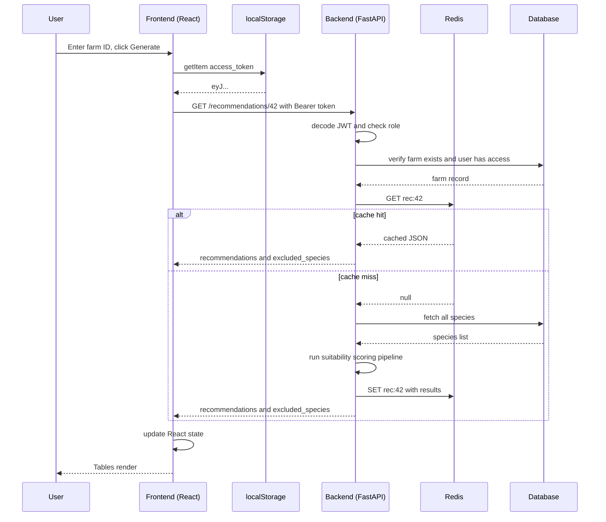

```mermaid
sequenceDiagram
    participant User
    participant FE as Frontend (React)
    participant LS as localStorage
    participant BE as Backend (FastAPI)
    participant Redis
    participant DB as Database

    User->>FE: Enter farm ID, click Generate
    FE->>LS: getItem access_token
    LS-->>FE: eyJ...
    FE->>BE: GET /recommendations/42 with Bearer token
    BE->>BE: decode JWT and check role
    BE->>DB: verify farm exists and user has access
    DB-->>BE: farm record
    BE->>Redis: GET rec:42
    alt cache hit
        Redis-->>BE: cached JSON
        BE-->>FE: recommendations and excluded_species
    else cache miss
        Redis-->>BE: null
        BE->>DB: fetch all species
        DB-->>BE: species list
        BE->>BE: run suitability scoring pipeline
        BE->>Redis: SET rec:42 with results
        BE-->>FE: recommendations and excluded_species
    end
    FE->>FE: update React state
    FE-->>User: Tables render
```
