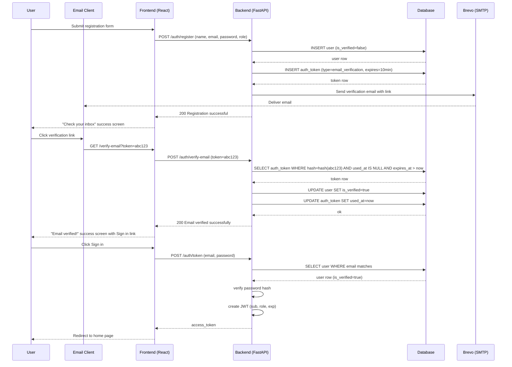

```mermaid
sequenceDiagram
    participant User
    participant Email as Email Client
    participant FE as Frontend (React)
    participant BE as Backend (FastAPI)
    participant DB as Database
    participant SMTP as Brevo (SMTP)

    User->>FE: Submit registration form
    FE->>BE: POST /auth/register (name, email, password, role)
    BE->>DB: INSERT user (is_verified=false)
    DB-->>BE: user row
    BE->>DB: INSERT auth_token (type=email_verification, expires=10min)
    DB-->>BE: token row
    BE->>SMTP: Send verification email with link
    SMTP-->>Email: Deliver email
    BE-->>FE: 200 Registration successful
    FE-->>User: "Check your inbox" success screen

    User->>Email: Click verification link
    Email->>FE: GET /verify-email?token=abc123
    FE->>BE: POST /auth/verify-email (token=abc123)
    BE->>DB: SELECT auth_token WHERE hash=hash(abc123) AND used_at IS NULL AND expires_at > now
    DB-->>BE: token row
    BE->>DB: UPDATE user SET is_verified=true
    BE->>DB: UPDATE auth_token SET used_at=now
    DB-->>BE: ok
    BE-->>FE: 200 Email verified successfully
    FE-->>User: "Email verified!" success screen with Sign in link

    User->>FE: Click Sign in
    FE->>BE: POST /auth/token (email, password)
    BE->>DB: SELECT user WHERE email matches
    DB-->>BE: user row (is_verified=true)
    BE->>BE: verify password hash
    BE->>BE: create JWT (sub, role, exp)
    BE-->>FE: access_token
    FE-->>User: Redirect to home page
```
