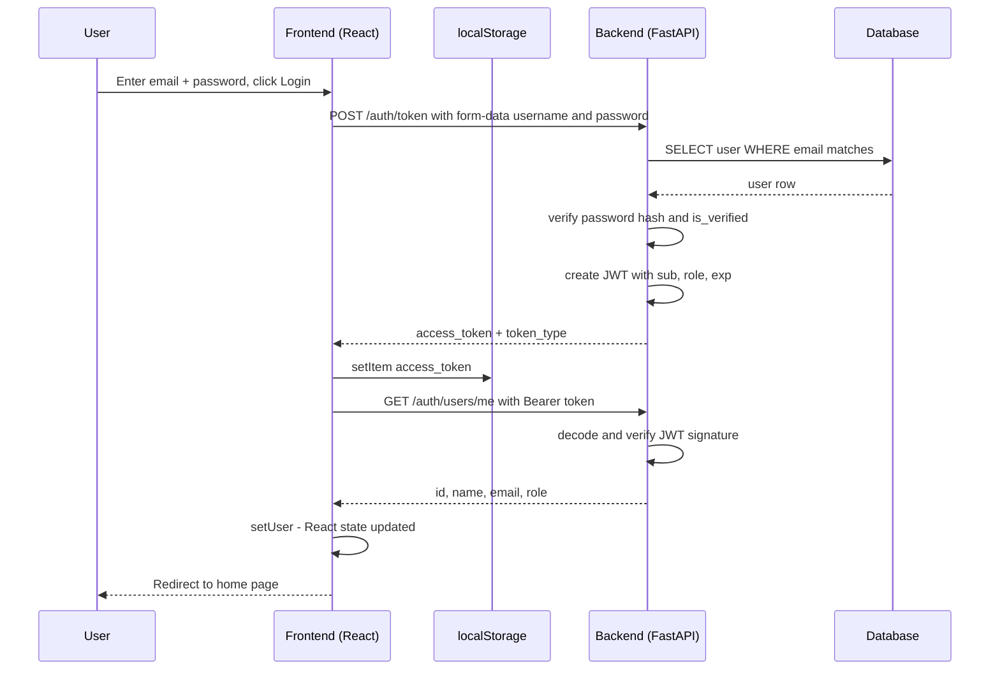

```mermaid
sequenceDiagram
    participant User
    participant FE as Frontend (React)
    participant LS as localStorage
    participant BE as Backend (FastAPI)
    participant DB as Database

    User->>FE: Enter email + password, click Login
    FE->>BE: POST /auth/token with form-data username and password
    BE->>DB: SELECT user WHERE email matches
    DB-->>BE: user row
    BE->>BE: verify password hash and is_verified
    BE->>BE: create JWT with sub, role, exp
    BE-->>FE: access_token + token_type
    FE->>LS: setItem access_token
    FE->>BE: GET /auth/users/me with Bearer token
    BE->>BE: decode and verify JWT signature
    BE-->>FE: id, name, email, role
    FE->>FE: setUser - React state updated
    FE-->>User: Redirect to home page
```